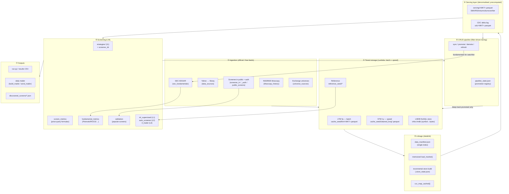
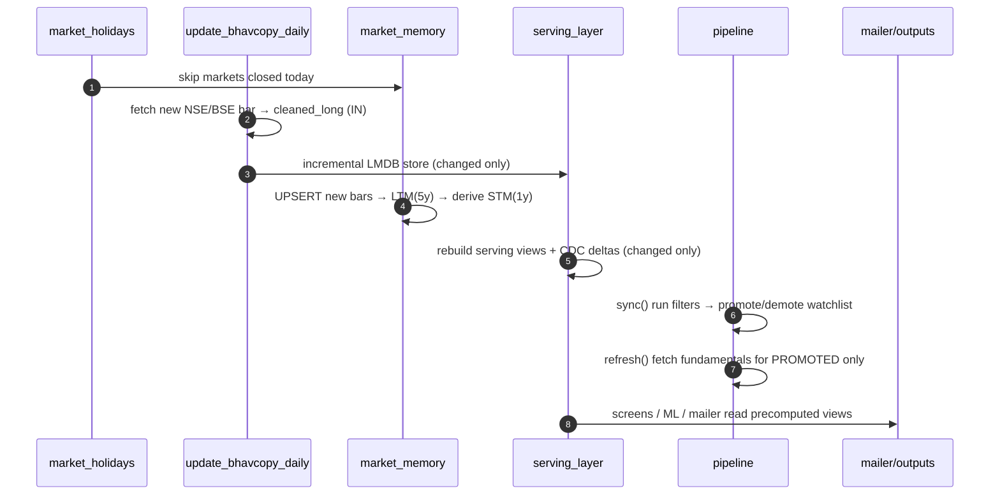
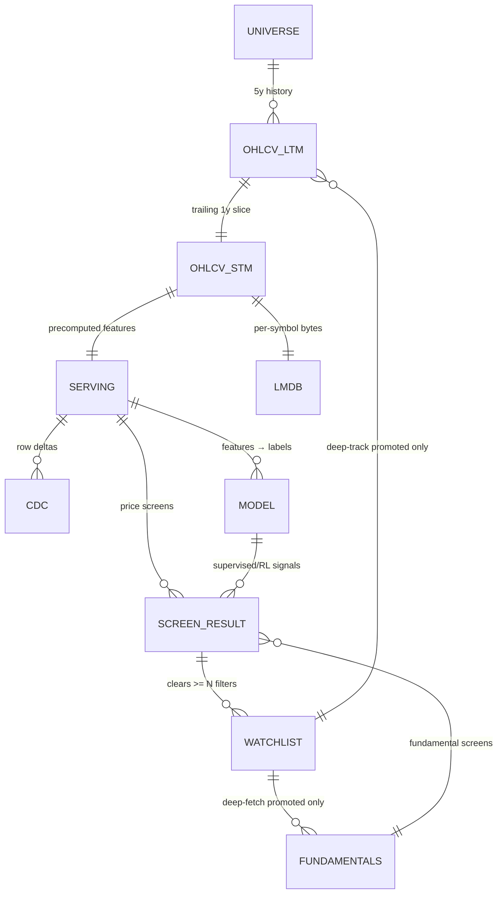

# Data Schema & Architecture Map

End-to-end map of the global stock screener: how data flows from raw exchange
feeds through the tiered memory, linkage, serving, ML and CRUD-pipeline layers to
the outputs. (GitHub renders the Mermaid diagrams below.)

> ⚠️ Educational / research only. NOT investment advice.

---

## 1. System architecture (layers)



---

## 2. Data flow (daily pipeline)



**CRUD tiering rule:** STM (1y) is kept for the **whole universe** (cheap); LTM (5y)
depth + expensive fundamentals are maintained **only for promoted (filter-clearing)
stocks**, bounding fetch/compute time. See `MEMORY_ARCHITECTURE.md`, `DATA_LINKAGE.md`.

---

## 3. Data schemas

### 3.1 OHLCV long frame — LTM & STM seeds
`cache_seed/ltm/<MKT>.parquet`, `cache_seed/cleaned_long[_MKT].parquet`

| column | type | notes |
|--------|------|-------|
| Symbol | str | bare ticker (NSE precedence on collisions) |
| Date | datetime64 | trading day |
| Open, High, Low, Close | float32 | prices |
| Volume | int64 | shares |

*Grain:* one row per (Symbol, Date). LTM = trailing 5y, STM = trailing 1y slice of LTM.

> **Storage note (dedup):** only the **LTM is committed** — the STM seeds
> (`cleaned_long*.parquet`) are 100% contained in the LTM, so they are **derived on
> first use** via `market_memory.ensure_stm_seeds()` rather than committed. This
> removed ~120 MB of duplicated data from the repo.

### 3.2 LMDB store — `ohlcv.lmdb`
| key | value |
|-----|-------|
| `<symbol>` (utf-8) | zstd Arrow IPC of that symbol's Date-indexed OHLCV frame |
| `__meta__` | `"{n_symbols}|{max_date}"` |

### 3.3 Serving view (denormalised) — `cache_seed/serving/<MKT>.parquet`
One row per symbol; precomputed at write-time so screening is a vectorised filter.

| column | meaning |
|--------|---------|
| Symbol, Market, Close, Bars, LastDate | identity |
| SMA20, SMA50, SMA200 | moving averages |
| RSI14 | Wilder RSI |
| High252, Low252, PctFromHigh, PctFromLow | 52-week extremes |
| Ret21, Ret63, Ret126, Ret252 | horizon returns % |
| Above200DMA, GoldenCross | trend flags |
| TurnoverLocal, Turnover_USD, Liquidity | liquidity (High/Medium/Low tier) |

### 3.4 CDC delta log — `cache_seed/cdc/<MKT>.parquet`
Blueprint delta model (Operation / Key / Value-Timestamp).

| column | meaning |
|--------|---------|
| op | INSERT / UPDATE |
| key | Symbol |
| value | Close at capture |
| asof | last bar date |
| ts | capture timestamp (UTC) |

### 3.5 Fundamentals cache — `cache_seed/fundamentals/<MKT>.parquet`
Per-symbol financials (US = SEC EDGAR, IN = screener.in auth).

| column (subset) | meaning |
|-----------------|---------|
| Symbol, source | identity / provenance |
| net_income(+_prev), revenue, cfo, ebit | income & cash |
| roe, roa(+_prev), debt_to_equity, current_ratio(+_prev) | ratios |
| gross_margin(+_prev), asset_turnover(+_prev), shares(+_prev) | Piotroski inputs |
| eps_growth, capex_history, dividend_history | growth / payout |

Derived at read time by `fundamental_metrics._enrich`: `piotroski` (0–9), `roce`,
`earnings_yield`, `fcf_yield`, `div_yield`.

### 3.6 Public popular screens — `cache_seed/public_screens/<key>.parquet`
Cached membership of Screener.in curated screens (Symbol + screen columns). 26 screens.

### 3.7 Promotion registry — `cache_seed/pipeline_state.json` *(gitignored)*
```json
{ "IN": { "promoted": { "WHEELS": { "filters": ["companies_creating_new_high",
  "multibagger_momentum", "popular"], "since": "2026-07-01",
  "refreshed": "2026-07-01" } }, "synced": "2026-07-01T13:54:14" } }
```

### 3.8 ML models — `cache_seed/models/<MKT>.pkl`, `<MKT>_rl.pkl` *(gitignored)*
| file | contents |
|------|----------|
| `<MKT>.pkl` | supervised classifier + feature list + effective horizon |
| `<MKT>_rl.pkl` | Q-table (state→8 action values) + action list |

### 3.9 Data index — `cache_seed/data_manifest.json` *(gitignored)*
Per-asset: market, tier, path, symbols, rows, date span, signature (size:mtime).

---

## 4. Entity relationships



---

## 5. Module → layer map

| Layer | Modules |
|-------|---------|
| Ingestion | `bhavcopy_history`, `bhavcopy_store`, `data_sources`, `sec_fundamentals`, `screener_in`, `screener_in_auth`, `public_screens`, `universe_sources`, `market_calendar`, `market_holidays` |
| Storage | `market_memory` (LTM/STM), `bhavcopy_store` (LMDB), `frames` (OHLCV helpers), `reference_data` |
| Linkage | `datalink` (manifest, memo, incremental store, CCC cache) |
| Serving | `serving_layer` (materialised views + CDC) |
| Screening | `strategies/`, `screener_kit`, `custom_screener`, `liquidity`, `screen_metrics`, `fundamental_metrics`, `validation` |
| ML | `ml_supervised` (L1), `auto_screener` (L2 unsupervised + RL correction), `rl_trader` (L3 PPO/Q), `pattern_discovery`, `ml_signal_engine` |
| Pipeline | `pipeline` (CRUD watchlist), `daily_memory.sh`, `update_bhavcopy_daily`, `daily_pipeline.sh` |
| Outputs | `run.py`, `build_mailer`, `send_mailer`, `run_global_analysis`, `market_performance` |

See also: `ARCHITECTURE.md`, `MEMORY_ARCHITECTURE.md`, `DATA_LINKAGE.md`,
`AUTO_SCREENER.md`, `DATA_AND_MODULES.md`.
